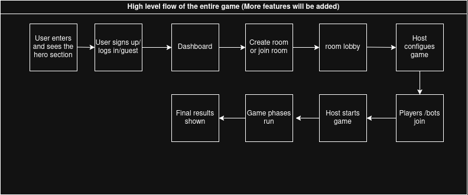
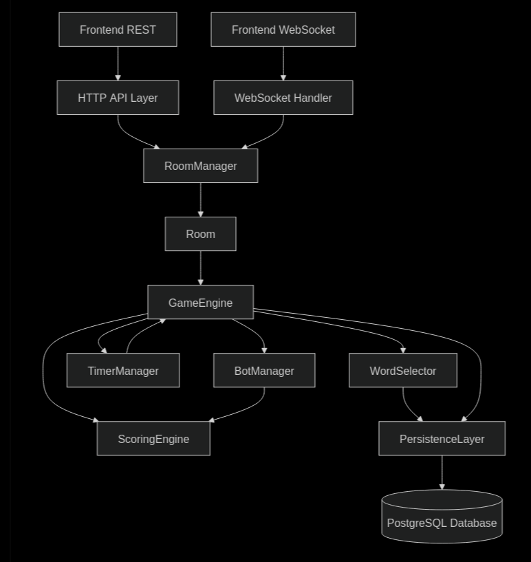
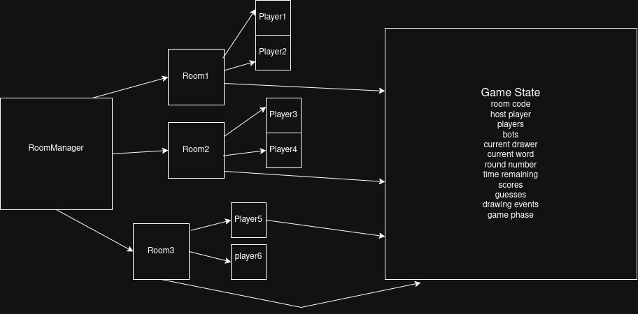
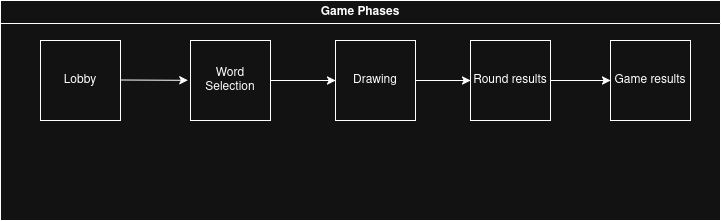

# Mithril Tiles Architecture

Mithril Tiles is designed as a real-time multiplayer drawing and guessing game. The core of the system is not a traditional request-response application where users mostly create and read records. The core experience is a live room where players join, draw, guess, receive score updates, and move through game phases together.

The architecture therefore separates two concerns:

- HTTP handles setup, discovery, configuration, and persistent data.
- WebSockets handle live gameplay, room state changes, drawing events, guesses, timers, and score updates.

For the initial version, the most important goal is to build a stable real-time game loop with in-memory active rooms. Persistence can be introduced gradually for word packs, user profiles, game history, replay events, and leaderboards.

## System Overview

The application has four major runtime areas:

- Frontend client
- Backend server
- Real-time room system
- Persistence layer

The frontend presents the user journey, room lobby, drawing canvas, guess/chat panel, scoreboard, round results, and final leaderboard. It talks to the backend over HTTP for non-live actions and uses a WebSocket connection once the player enters a room.

The backend is the authority for active rooms, connected players, game phases, current drawer, current word, scores, timers, and validation. Clients may request actions, but the server decides whether those actions are valid.

The database is not required for every live action. Live room state should stay in memory for the MVP so that gameplay remains fast and simple. The database becomes important for data that must survive after a room ends.

## Primary Architecture Principle

The backend should be server-authoritative.

Players can send events such as joining a room, starting a game, drawing a stroke, or submitting a guess. The backend validates those events against the current room state before broadcasting anything to other players.

Examples:

- A player can only draw if they are the current drawer.
- A guess only counts if the room is in the drawing phase.
- The current word is only visible to the drawer during the round.
- Score changes are calculated by the backend, not by the browser.
- Phase transitions are controlled by the game engine, not by individual clients.

This protects the game from cheating, broken clients, race conditions, and inconsistent state between players.

## High-Level User Flow

The main user journey follows this sequence:

1. User enters the site and sees the hero or entry screen.
2. User signs up, logs in, or continues as a guest.
3. User reaches the dashboard or main play screen.
4. User creates a room or joins an existing room.
5. User enters the room lobby.
6. Host configures game settings.
7. Players and optional bots join the room.
8. Host starts the game.
9. Game phases run until all rounds are complete.
10. Final results and leaderboard are shown.

This flow should remain the product-level path even if later features are added around profiles, ranked modes, word packs, or replays.

## Communication Model

The system uses two communication paths.

### HTTP Path

HTTP is used for actions that are not continuously changing during live gameplay.

Typical responsibilities:

- Create a room.
- Fetch room metadata.
- Fetch available word packs.
- Save or read user profile data.
- Load historical game results.
- Load replay data after a match.
- Perform health checks.

HTTP should not be responsible for the live drawing and guessing loop. It is useful before and after gameplay, not during every second of gameplay.

### WebSocket Path

WebSockets are used once a player is inside a room and live interaction begins.

Typical responsibilities:

- Register a player in a room.
- Notify others that a player joined or left.
- Broadcast room state.
- Start the game.
- Start each round.
- Stream drawing stroke events.
- Submit guesses.
- Broadcast normal guesses.
- Broadcast correct guesses.
- Update scores.
- Send timer updates.
- End rounds.
- Show round results.
- End the game.
- Show the final leaderboard.

The WebSocket layer is the heart of the game experience because players need immediate feedback from each other.

## Main Runtime Components

### Frontend Client

The frontend owns presentation and local interaction state. It should make the game feel responsive while still respecting the backend as the source of truth.

Frontend responsibilities:

- Display lobby, game, results, and leaderboard screens.
- Open and maintain the WebSocket connection.
- Send player actions to the backend.
- Render server-approved room state.
- Render incoming drawing events onto the canvas.
- Capture local drawing input from the drawer.
- Capture guess input from guessers.
- Keep local UI state such as brush color, brush size, input text, and open panels.

The frontend should not independently decide who won points, whether a guess is correct, which phase comes next, or which player is allowed to draw.

### Backend Server

The backend receives both HTTP and WebSocket traffic. Its main job is to coordinate active rooms and keep gameplay consistent.

Backend responsibilities:

- Accept room setup requests.
- Accept WebSocket connections.
- Route each live message to the correct room.
- Maintain active room state.
- Validate player permissions.
- Coordinate game phase changes.
- Select drawers and words.
- Validate guesses.
- Award scores.
- Drive timers.
- Manage bots.
- Broadcast state updates to room participants.
- Persist long-term data when needed.

The backend should be treated as the single authority for gameplay.

### Room Manager

The room manager tracks all active rooms currently running on the server.

Responsibilities:

- Create a new room.
- Find a room by code.
- Register players into rooms.
- Remove disconnected players.
- Delete empty rooms.
- Keep active rooms isolated from each other.

Each room has its own players, bots, settings, game state, timer, drawing events, and score table. A message from one room must never leak into another room.

### Room

A room is the live container for one game session.

A room contains:

- Room code.
- Host player.
- Human players.
- Bot players.
- Room settings.
- Current game phase.
- Current round number.
- Current drawer.
- Current word.
- Remaining time.
- Scores.
- Correct guessers.
- Drawing events for the active round.
- Connection references for live broadcasting.

The room is where live state is grouped. The game engine operates on the room, and the WebSocket layer broadcasts room changes to connected clients.

### Game Engine

The game engine controls the rules of the game.

Responsibilities:

- Start the game.
- Move from lobby into gameplay.
- Select the drawer.
- Select the word.
- Start a round.
- Validate drawing permission.
- Validate guesses.
- Award points.
- Track correct guessers.
- End the round.
- Decide whether another round should start.
- End the game.
- Produce round results and final leaderboard.

The game engine should not be thought of as a network component. It does not exist to manage raw WebSocket connections. It exists to apply game rules to a room and produce events that can be broadcast.

### Timer Manager

The timer manager drives timed transitions.

Responsibilities:

- Start round countdowns.
- Emit timer updates.
- Trigger round end when time expires.
- Support short delays between round results and the next round.
- Prevent multiple timers from controlling the same room at once.

Timers are important because many events can happen at the same time: a user may guess correctly as the round expires, a player may disconnect, or a host may leave. The backend needs clear ownership over timing so the room does not advance twice.

### Bot Manager

Bots are server-controlled players used to make rooms feel alive when there are not enough humans.

Bot responsibilities:

- Join rooms as fake players.
- Generate guesses on a schedule.
- Use different behavior styles.
- Send guesses through the same validation path as human players.
- Receive scores using the same scoring rules.

Bots should not bypass the game engine. A bot guess should be treated like any other guess: submitted, validated, broadcast, and scored if correct.

### Word Selector

The word selector chooses the word for each round.

Responsibilities:

- Load available words from the selected word pack.
- Avoid repeating recently used words.
- Respect difficulty or category settings if enabled.
- Return the selected word only to backend-controlled game state.
- Allow the drawer to see the word without revealing it to guessers.

The selected word is sensitive state during the drawing phase. It should never be broadcast to all players until the round results phase.

### Scoring Engine

The scoring engine calculates points.

Responsibilities:

- Award points to correct guessers.
- Award points to the drawer when others guess correctly.
- Optionally scale points by remaining time.
- Prevent duplicate points for the same player in the same round.
- Produce score updates for broadcast.

Scoring must be deterministic and server-owned. Clients display score updates but do not calculate official scores.

### Persistence Layer

The persistence layer stores data that should survive after the room ends.

Early persistence can be minimal. The live MVP can run mostly from memory, with persistence added where it provides direct product value.

Potential stored data:

- Users.
- Guest sessions.
- Word packs.
- Game history.
- Final leaderboards.
- Replay drawing events.
- Saved drawing images.
- Room settings presets.

The persistence layer should not be in the critical path for every drawing stroke during MVP. Live drawing should remain event-based and fast.

## Game State Model

Every room owns a game state. The state should be modeled as an explicit phase machine instead of a set of disconnected booleans.

Recommended phases:

- Lobby
- Word Selection
- Drawing
- Round Results
- Game Results

The simplified MVP may combine or skip word selection as a visible phase, but the backend should still conceptually perform word selection before drawing begins.

### Lobby

Players gather in the room. The host can configure match settings.

State includes:

- Room code.
- Host.
- Player list.
- Bot list.
- Round count.
- Round duration.
- Selected word pack.
- Bot settings.
- Theme or drawing options.

Allowed actions:

- Join room.
- Leave room.
- Change nickname.
- Add or remove bots.
- Update settings if host.
- Start game if host.

### Word Selection

The system selects or presents a word before drawing begins.

Possible designs:

- Automatic word selection by the server.
- Drawer chooses one word from a small set.
- Host-defined word pack determines the options.

State includes:

- Current drawer.
- Candidate words if drawer choice is supported.
- Final selected word.
- Short selection timer if needed.

Only the drawer should see the selected word before the drawing phase begins.

### Drawing

The current drawer draws while other players guess.

State includes:

- Current drawer.
- Hidden word.
- Round timer.
- Stroke events.
- Guess stream.
- Correct guessers.
- Current scores.

Allowed actions:

- Drawer sends drawing events.
- Guessers submit guesses.
- Bots submit guesses.
- Server validates guesses.
- Server broadcasts accepted strokes and guesses.
- Server sends timer and score updates.

Disallowed actions:

- Non-drawers sending drawing events.
- Drawer submitting guesses for their own word.
- Guessers receiving the secret word.
- Clients directly updating scores.

### Round Results

The round has ended and the word is revealed.

State includes:

- Revealed word.
- Correct guessers.
- Points awarded.
- Updated scores.
- Drawer summary.
- Optional drawing replay or final canvas preview.

Allowed actions:

- Display results.
- Prepare next round.
- Continue automatically after a short delay.

### Game Results

All rounds are complete.

State includes:

- Final leaderboard.
- Total scores.
- Winner.
- Game summary.
- Optional replay/save metadata.

Allowed actions:

- Return to dashboard.
- Play again.
- Create a new room.
- Save or share results if supported.

## WebSocket Interaction Flow

The live interaction sequence follows the diagram below.

1. Player client connects to the WebSocket server with a room code.
2. WebSocket server asks the room manager to register the player.
3. Room manager sends the current room state back to the joining player.
4. Room manager broadcasts `player.joined` to other players.
5. Host sends `game.start`.
6. WebSocket server forwards the start request to the game engine.
7. Game engine selects drawer and word.
8. Room manager broadcasts `round.started`.
9. Current drawer sends drawing strokes.
10. Game engine validates that the sender is allowed to draw.
11. Accepted strokes are broadcast to other players.
12. Guessers submit guesses.
13. Game engine validates each guess.
14. If the guess is correct, score updates and correct-guess messages are broadcast.
15. If the guess is incorrect, the guess is broadcast as a normal guess.
16. When time expires or the round is otherwise complete, the game engine ends the round.
17. Room manager broadcasts round results.
18. If more rounds remain, the next round starts.
19. If the match is complete, final leaderboard is broadcast.

This sequence keeps the frontend simple: it sends player intent and renders server events. The backend remains responsible for validation and state transitions.

## Message Categories

The exact message schema can be decided during implementation, but the architecture should preserve clear categories.

### Client To Server

- Join room.
- Leave room.
- Start game.
- Update room settings.
- Select word if drawer choice is supported.
- Start drawing stroke.
- Continue drawing stroke.
- End drawing stroke.
- Clear canvas.
- Submit guess.
- Send chat message if chat is allowed.

### Server To Client

- Full room state.
- Player joined.
- Player left.
- Settings updated.
- Game started.
- Round started.
- Timer updated.
- Drawing stroke accepted.
- Canvas cleared.
- Guess received.
- Guess correct.
- Score updated.
- Bot guess received.
- Round ended.
- Round results.
- Game ended.
- Final leaderboard.
- Error or rejection.

Every message should have a clear type and a payload. Rejections should be explicit so the frontend can recover cleanly.

## Drawing Event Architecture

The canvas should synchronize drawing events, not full images.

The drawer sends small stroke events as they draw. The backend validates that the sender is the current drawer, then broadcasts those stroke events to everyone else in the room.

Important rules:

- Do not send a full canvas image on every pointer movement.
- Send stroke start, stroke move, stroke end, and clear events.
- Normalize coordinates so different screen sizes can render the same drawing.
- Broadcast only accepted drawing events.
- Store drawing events later if replay support is needed.

This approach supports live drawing, replay, spectating, and future persistence with the same event stream.

## State Ownership

State should be divided into three categories.

### Server-Owned State

The backend owns anything that affects fairness, scoring, or shared room truth.

Examples:

- Players.
- Host.
- Bots.
- Current phase.
- Current round.
- Current drawer.
- Current word.
- Timer.
- Scores.
- Correct guessers.
- Room settings.
- Round results.

### Client-Owned State

The browser owns temporary interface state.

Examples:

- Selected brush color.
- Selected brush size.
- Chat input text.
- Local pointer position.
- Open or collapsed panels.
- Local loading indicators.
- Current viewport layout.

### Derived State

Derived state is calculated from server-owned state and the current player identity.

Examples:

- Whether the current player is the drawer.
- Whether the current player can draw.
- Whether the current player can guess.
- Whether the word should be visible.
- Whether the start button should be enabled.

Derived state should be recalculated on the frontend for display, but the backend must still enforce the real permission rules.

## Room Lifecycle

Rooms move through a predictable lifecycle.

1. Room is created.
2. Host joins.
3. Other players and bots join.
4. Host configures settings.
5. Host starts the game.
6. Rounds run through the game state machine.
7. Final results are shown.
8. Room either resets for another game or expires.
9. Empty room is deleted from active memory.
10. Optional history is saved.

Room cleanup matters. Without cleanup, empty rooms and dead WebSocket connections can accumulate over time.

## Disconnect And Reconnect Behavior

Real-time games must handle unreliable connections.

Expected behavior:

- If a non-host player disconnects, the room removes or marks them disconnected.
- If a player reconnects quickly, the server can send the full room state again.
- If the drawer disconnects during drawing, the backend should either end the round or select a replacement depending on product rules.
- If the host disconnects in the lobby, host ownership should transfer or the room should close.
- If the host disconnects during gameplay, the game should continue if enough players remain.
- Empty rooms should be deleted after a short grace period.

The simplest MVP behavior is to remove disconnected players and transfer host to the next human player when possible.

## Bot Flow

Bots behave like room participants controlled by the server.

Bot lifecycle:

1. Host enables bots or sets a bot count.
2. Room manager adds bots to the player list.
3. Bot manager schedules guesses during drawing.
4. Bot guesses are submitted through the same game engine validation used by human guesses.
5. Correct bot guesses receive points.
6. Bot activity is broadcast so human players see the room as active.

Bot difficulty can be modeled by timing and accuracy:

- Easy bots guess vaguely and may never get the word.
- Normal bots get closer over time.
- Strong bots may guess correctly near the end.

## Persistence Strategy

The MVP can use in-memory state for active rooms. This keeps the first version focused on live gameplay.

Persistence can be introduced in layers:

### MVP Or Early Version

- Active rooms in memory.
- Built-in word list or simple stored word packs.
- No required game history.
- No replay requirement.

### Next Stage

- Store user profiles.
- Store word packs.
- Store completed game summaries.
- Store final leaderboards.

### Later Stage

- Store replay event streams.
- Store saved drawing images.
- Store long-term stats.
- Add Redis or another shared state layer if multiple backend instances are needed.

The system should not require full persistence before the game can be fun.

## Scaling Path

The initial architecture can run as one backend instance with in-memory rooms.

When scaling becomes necessary, the main challenge is that WebSocket connections and room state are live. Multiple backend instances require a way to route players from the same room to the same instance or share room events between instances.

Scaling options:

- Sticky sessions so all players in a room connect to the same backend instance.
- Redis pub/sub or a similar broker for cross-instance room events.
- Shared ephemeral state for room membership and presence.
- Database persistence for completed games, not every live event.

The first version does not need this complexity, but the architecture leaves room for it.

## Reliability And Validation Rules

The backend should enforce these rules:

- Only existing rooms can be joined.
- Nicknames should be validated.
- Room capacity should be enforced.
- Only host can change lobby settings.
- Only host can start the game.
- Game can start only with valid settings and enough participants.
- Only drawer can send drawing events.
- Drawer cannot guess their own word.
- Guesses only count during the drawing phase.
- A player can receive correct-guess points only once per round.
- Timer expiration can end a round only once.
- The secret word is revealed only during round results or game results.

These rules are part of the architecture, not just implementation details, because they define the trust boundary between client and server.

## Security And Abuse Considerations

Even for an MVP, real-time rooms need basic protection.

Recommended protections:

- Validate all incoming message types.
- Validate payload sizes.
- Rate-limit drawing events per client.
- Rate-limit guesses and chat messages.
- Ignore messages that do not match the current phase.
- Sanitize display names and chat text.
- Do not trust client-provided player IDs for authority decisions.
- Close idle or unhealthy WebSocket connections.
- Use heartbeat or ping-pong checks for stale clients.

This keeps rooms stable and prevents one bad client from degrading the experience for everyone else.

## Architecture Summary

Mithril Tiles should be built around live rooms and event-driven gameplay.

The frontend is responsible for interaction and rendering. The backend is responsible for truth, validation, room coordination, game rules, timers, bots, and scoring. HTTP supports setup and persistence, while WebSockets carry the live game.

The most important architectural choices are:

- Keep live gameplay server-authoritative.
- Use WebSockets for game events.
- Keep active room state in memory for the MVP.
- Model game progress as explicit phases.
- Send drawing events instead of full canvas images.
- Treat bots like normal players whose actions pass through the same validation path.
- Add persistence and multi-server scaling only after the core loop works.

This gives the project a strong foundation without committing too soon to framework-specific implementation details.
