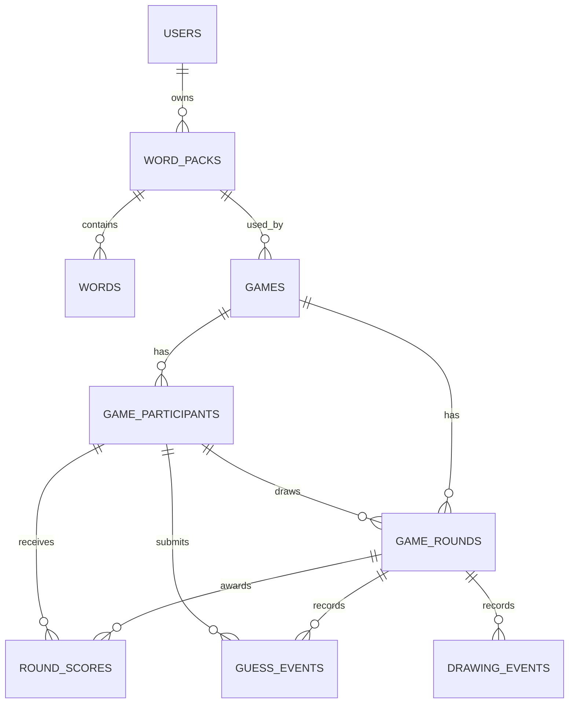

# Mithril Tiles Database Design

This document describes the database design for Mithril Tiles at a product and system level. It is not a migration file and does not define implementation-specific code. The goal is to make the data model clear before choosing exact database migrations, indexes, constraints, or ORM/query-layer details.

Mithril Tiles is a real-time multiplayer drawing and guessing game, so the database should not try to store every piece of live room state during gameplay. The live game loop should stay fast and server-authoritative in memory. The database should store data that needs to survive after a request, after a match, or after a server restart.

## Database Role

The database supports three main needs:

- Persistent product data, such as users, word packs, and profile settings.
- Completed-game history, such as matches, rounds, participants, scores, and final results.
- Optional replay and analytics data, such as drawing events, guesses, and saved game summaries.

The database is not the source of truth for active WebSocket room state during the MVP. Active rooms, live timers, connected sockets, current drawer, current word, and in-progress guesses should live in the backend room manager while a game is running.

## Core Principle

Persist outcomes, not every live heartbeat.

During gameplay, the backend manages the active room in memory. At important moments, the backend can write snapshots or final records to the database.

Examples of good persistence points:

- Room is created.
- Game starts.
- Round starts.
- Round ends.
- Game ends.
- Final leaderboard is produced.
- Replay is explicitly saved.

Examples of data that should not require a database write on every live event during MVP:

- Every timer tick.
- Every temporary lobby update.
- Every active WebSocket presence change.
- Every stroke movement unless replay recording is enabled.
- Every transient client state change.

This keeps the database from becoming a bottleneck for live play.

## Data Ownership Boundaries

### In-Memory Active State

This state belongs to the live backend room system:

- Active room code.
- Connected players.
- Active WebSocket connections.
- Current game phase.
- Current drawer.
- Current hidden word.
- Current round timer.
- In-progress canvas strokes.
- In-progress guesses.
- Temporary bot schedules.
- Temporary score table before final save.

This state can be lost if the server restarts unless a later version adds recovery or shared state storage.

### Persistent Database State

This state belongs in the database:

- Registered users.
- Guest player records if guest history is needed.
- Word packs and words.
- Game records after a match starts or ends.
- Game participants.
- Round summaries.
- Final scores.
- Replay events if replay support is enabled.
- User stats.
- Saved drawings or references to stored images.

The database should describe what happened, not micromanage what is happening every millisecond.

## Recommended Database

PostgreSQL is a strong fit because the project needs:

- Relational integrity between games, rounds, players, and scores.
- Flexible JSON fields for settings, replay events, or evolving metadata.
- Good indexing for leaderboards and history screens.
- Reliable transactions for finalizing a game.
- Future compatibility with analytics and reporting.

## MVP Persistence Scope

The first useful database version should stay small.

Recommended MVP tables:

- Users
- Word packs
- Words
- Games
- Game participants
- Game rounds
- Round scores or final scores

Optional MVP tables:

- Guest sessions
- Drawing replay events
- Guess events

The safest MVP path is to persist word data and completed game summaries first. Replay storage can come later unless replay is a launch requirement.

## Entity Overview

### Users

Stores registered player accounts.

Purpose:

- Identify returning players.
- Own created word packs.
- Attach long-term game stats.
- Support profiles and leaderboards.

Important fields:

- User ID.
- Display name.
- Email or external auth identity.
- Avatar reference.
- Account status.
- Created timestamp.
- Updated timestamp.

Notes:

- Guest players do not need full user records unless the product wants guest history.
- Usernames and display names should be separate if uniqueness matters.
- Authentication data should be handled carefully and not mixed into gameplay state.

### Guest Sessions

Stores temporary guest identities when the product allows playing without login.

Purpose:

- Allow guest play.
- Preserve a temporary identity during one browser session.
- Optionally attach a completed game to a guest nickname.

Important fields:

- Guest ID.
- Display name.
- Session token hash or anonymous identifier.
- Created timestamp.
- Expiration timestamp.

Notes:

- Guest sessions can be cleaned up periodically.
- A game participant can point to either a registered user or a guest identity.

### Word Packs

Stores groups of words used during matches.

Purpose:

- Organize playable words by theme, difficulty, language, or creator.
- Allow default packs and user-created packs.
- Support moderation and publishing later.

Important fields:

- Word pack ID.
- Name.
- Description.
- Language.
- Visibility.
- Owner user ID.
- Status.
- Created timestamp.
- Updated timestamp.

Recommended statuses:

- Draft.
- Published.
- Archived.
- Moderation required.

Notes:

- System/default word packs may not have an owner.
- Visibility can separate private packs from public packs.

### Words

Stores individual drawable words.

Purpose:

- Provide words for the game engine.
- Support difficulty, category, and language.
- Avoid repeated words during a game.

Important fields:

- Word ID.
- Word pack ID.
- Text.
- Normalized text.
- Category.
- Difficulty.
- Language.
- Status.
- Created timestamp.

Notes:

- The normalized text helps compare guesses consistently.
- Words should be unique within a word pack after normalization.
- Sensitive or inappropriate words can be archived without deleting historical game records.

### Games

Stores one completed or started match.

Purpose:

- Represent a full play session.
- Store match settings and final outcome.
- Anchor rounds, participants, and scores.

Important fields:

- Game ID.
- Room code used during play.
- Host participant or host user.
- Word pack ID.
- Game status.
- Settings snapshot.
- Started timestamp.
- Ended timestamp.
- Created timestamp.

Recommended statuses:

- Created.
- Started.
- Completed.
- Abandoned.
- Cancelled.

Notes:

- The settings snapshot should preserve values such as round count, round duration, bot count, scoring mode, and theme.
- The database game record should not be required before every lobby exists. For MVP, it can be created when the host starts the match.

### Game Participants

Stores each human or bot that participated in a game.

Purpose:

- Preserve the final participant list.
- Support score history.
- Distinguish users, guests, and bots.
- Track who hosted and who won.

Important fields:

- Participant ID.
- Game ID.
- User ID if registered.
- Guest ID if guest.
- Bot profile ID if bot.
- Display name snapshot.
- Participant type.
- Is host.
- Joined timestamp.
- Left timestamp.
- Final score.
- Final rank.

Recommended participant types:

- Registered user.
- Guest.
- Bot.

Notes:

- Display name should be snapshotted so old game history does not change if a user renames themselves later.
- Participant records should not depend only on live WebSocket connection IDs.

### Game Rounds

Stores each round within a game.

Purpose:

- Preserve round order and outcome.
- Track drawer, selected word, timer, and result.
- Support replay or post-game summaries.

Important fields:

- Round ID.
- Game ID.
- Round number.
- Drawer participant ID.
- Word ID.
- Word text snapshot.
- Started timestamp.
- Ended timestamp.
- Duration seconds.
- Round status.

Recommended statuses:

- Started.
- Completed.
- Skipped.
- Abandoned.

Notes:

- Store a word text snapshot in addition to the word ID. This protects history if the word is edited later.
- The hidden word should not be exposed to clients before the round ends, but it can be stored after selection if the backend is trusted.

### Round Scores

Stores scoring changes per round.

Purpose:

- Explain how final scores were produced.
- Show per-round summaries.
- Support fairness audits.

Important fields:

- Round score ID.
- Round ID.
- Participant ID.
- Points earned.
- Score reason.
- Awarded timestamp.

Recommended score reasons:

- Correct guess.
- Drawer bonus.
- Time bonus.
- Participation bonus.
- Penalty.

Notes:

- This table is useful if the game wants transparent scoring.
- If MVP needs only a final leaderboard, this can be simplified into participant final scores first.

### Guess Events

Stores guesses when replay, moderation, analytics, or detailed history is required.

Purpose:

- Preserve chat/guess history.
- Reconstruct round activity.
- Analyze common guesses.
- Support replay timelines.

Important fields:

- Guess event ID.
- Round ID.
- Participant ID.
- Guess text.
- Normalized guess text.
- Is correct.
- Points awarded.
- Submitted timestamp.

Notes:

- This can grow quickly, so it should be optional for MVP.
- Guess text should be sanitized before display.
- If chat messages are separate from guesses, chat can use a separate event table later.

### Drawing Events

Stores canvas events when replay support is enabled.

Purpose:

- Reconstruct drawings.
- Support replay playback.
- Support saved match history.

Important fields:

- Drawing event ID.
- Round ID.
- Participant ID.
- Event type.
- Event order.
- Event timestamp.
- Coordinate data.
- Brush data.

Recommended event types:

- Stroke start.
- Stroke move.
- Stroke end.
- Clear canvas.

Notes:

- For high-volume replay storage, event payloads can be batched.
- Coordinates should be normalized so replay works across screen sizes.
- This table should not be required for basic live gameplay.

### Bot Profiles

Stores reusable bot definitions if bots become configurable.

Purpose:

- Give bots consistent names and behavior styles.
- Support different difficulty levels.
- Allow future personality tuning.

Important fields:

- Bot profile ID.
- Name.
- Difficulty.
- Behavior style.
- Avatar reference.
- Active status.

Notes:

- MVP bots can be hardcoded without a table.
- A table becomes useful once the product has named bots, bot difficulty selection, or unlockable bot personalities.

### User Stats

Stores aggregated statistics for profiles and leaderboards.

Purpose:

- Show long-term progress.
- Avoid recalculating expensive stats from all historical games.
- Support global or seasonal leaderboards.

Important fields:

- User ID.
- Games played.
- Games won.
- Total score.
- Correct guesses.
- Draw rounds played.
- Average rank.
- Updated timestamp.

Notes:

- Stats can be updated when a game completes.
- Stats should be derived from game history, so they can be rebuilt if needed.

## Suggested Relationship Model

At a high level:

- A user can own many word packs.
- A word pack contains many words.
- A game uses one word pack.
- A game has many participants.
- A game has many rounds.
- A round has one drawer participant.
- A round uses one word.
- A round can have many score records.
- A round can have many guess events.
- A round can have many drawing events.
- A participant can be a registered user, a guest, or a bot.

Conceptual relationship map:

## Data Flow By Game Lifecycle

### Before Game Starts

Database may be used to:

- Load available word packs.
- Load words for the selected pack.
- Load user profile or guest identity.
- Save room configuration only if the product wants persistent room presets.

Database should not be required to:

- Track every lobby heartbeat.
- Track every active connection.
- Track every temporary room state update.

### When Game Starts

The backend can create a game record.

Recommended saved data:

- Room code.
- Host.
- Selected word pack.
- Settings snapshot.
- Start timestamp.
- Initial participant list.

This creates a durable anchor for the match without slowing down the lobby.

### When Each Round Starts

The backend can create a round record.

Recommended saved data:

- Game ID.
- Round number.
- Drawer participant.
- Selected word.
- Word text snapshot.
- Start timestamp.
- Round duration.

If replay is enabled, drawing and guess events can begin attaching to this round.

### During Drawing

The database should be used carefully.

MVP:

- Keep drawing events in memory.
- Keep guesses in memory.
- Keep scoring in memory.
- Save only final round outcome.

Replay-enabled version:

- Batch drawing events.
- Store guess events.
- Store event order and timestamps.

Important: avoid one database write per pointer movement unless batching or streaming storage has been designed.

### When Round Ends

The backend should save round outcome.

Recommended saved data:

- Round end timestamp.
- Correct guessers.
- Round scores.
- Final word reveal.
- Optional replay summary.

This is a natural persistence point because the round is now stable.

### When Game Ends

The backend should finalize the game.

Recommended saved data:

- Game status.
- End timestamp.
- Final participant scores.
- Final ranks.
- Winner.
- Optional stats updates.

This is the most important persistence point for MVP history and leaderboards.

## Indexing Strategy

Indexes should support real product queries, not every possible column.

Recommended early indexes:

- Users by email or auth provider identity.
- Users by display handle if handles are unique.
- Word packs by owner.
- Word packs by visibility and status.
- Words by word pack.
- Words by normalized text within a word pack.
- Games by created timestamp.
- Games by host or creator.
- Game participants by game.
- Game participants by user.
- Game rounds by game and round number.
- Round scores by round.
- Guess events by round if stored.
- Drawing events by round and event order if stored.

Leaderboard indexes can be added once the leaderboard rules are clear.

## Integrity Rules

Recommended database constraints:

- Word text should be required.
- Word pack name should be required.
- Room code should be stored as a snapshot on games.
- Round number should be unique within a game.
- A participant should belong to exactly one game.
- A final rank should be unique within a completed game if ranks are strict.
- A word should be unique within a word pack by normalized text.
- A user-owned private word pack should always have an owner.
- Completed games should have an end timestamp.
- Completed rounds should have an end timestamp.

Some gameplay rules should stay in backend logic rather than only database constraints, especially rules involving active room phase, timers, and WebSocket permissions.

## JSON And Snapshot Fields

PostgreSQL JSON fields can be useful, but they should be used intentionally.

Good uses:

- Game settings snapshot.
- Theme settings.
- Bot configuration snapshot.
- Drawing event payloads.
- Flexible replay metadata.
- Client/device metadata for analytics.

Poor uses:

- Replacing all relationships with unstructured blobs.
- Storing users, participants, rounds, and scores only inside one giant game JSON field.
- Hiding fields that need frequent filtering or indexing.

Rule of thumb: if the app needs to query it often, make it a real column or relation. If the app mostly preserves it as a historical snapshot, JSON can be fine.

## Replay Storage Strategy

Replay support has a major impact on database volume.

There are three possible levels:

### No Replay

Only save game, participants, rounds, and scores.

Best for:

- Fast MVP.
- Simple leaderboards.
- Minimal storage.

### Summary Replay

Save round result, final canvas image, and maybe key guesses.

Best for:

- Shareable match summaries.
- Lower storage than full replay.
- Simple post-game review.

### Full Event Replay

Save ordered drawing events and guesses.

Best for:

- Replaying the drawing process.
- Spectator playback.
- Detailed match history.

Tradeoff:

- More storage.
- More write volume.
- More careful event ordering required.

Recommendation: start with no replay or summary replay, then add full event replay after the core game feels good.

## Data Retention

Not all data needs to live forever.

Suggested retention:

- User accounts: kept until deleted by user or admin.
- Word packs: kept while active, archived when removed.
- Completed game summaries: kept long-term.
- Guest sessions: expire after a short period.
- Abandoned games: kept briefly or marked abandoned.
- Drawing events: retained only if replay is a product feature.
- Raw guess/chat events: retained based on moderation and privacy needs.

Retention should be decided before storing high-volume replay and chat data.

## Privacy And Safety

The database should avoid storing unnecessary sensitive data.

Guidelines:

- Store only required profile data.
- Sanitize display names and chat text before showing them.
- Avoid storing raw authentication secrets.
- Hash session tokens if guest sessions are persisted.
- Allow user-owned data to be deleted or anonymized later.
- Keep moderation status for public word packs.
- Preserve historical game records with display-name snapshots where needed.

## MVP Database Recommendation

For the first real version, keep the database small and useful.

Recommended MVP:

- Users or guest identities.
- Word packs.
- Words.
- Games.
- Game participants.
- Game rounds.
- Final scores.

Avoid at first unless required:

- Full drawing replay.
- Full chat history.
- Every guess event.
- Persistent active rooms.
- Complex seasonal leaderboards.
- Multi-region data replication.

This lets the team build the live game first while still having enough persistence for word packs, completed games, and basic profile history.

## Open Decisions

These decisions should be made before migrations are finalized:

- Will users be required, or will guest play be first-class?
- Should a game record be created when a room is created or only when the match starts?
- Do we need full replay at launch?
- Should guesses be stored permanently?
- Should chat exist separately from guesses?
- Should users be able to create public word packs?
- Do bots need database profiles or can they be hardcoded for MVP?
- What leaderboard types matter first: global, friends, room-only, weekly, or lifetime?
- How long should abandoned rooms and guest sessions be retained?

## Working Recommendation

Build the database around completed gameplay history and reusable content, not active WebSocket state.

The first database version should persist word packs, words, game summaries, participants, rounds, and final scores. Keep active rooms in memory. Add replay events, guess history, detailed analytics, and advanced leaderboards once the core game loop is stable.
