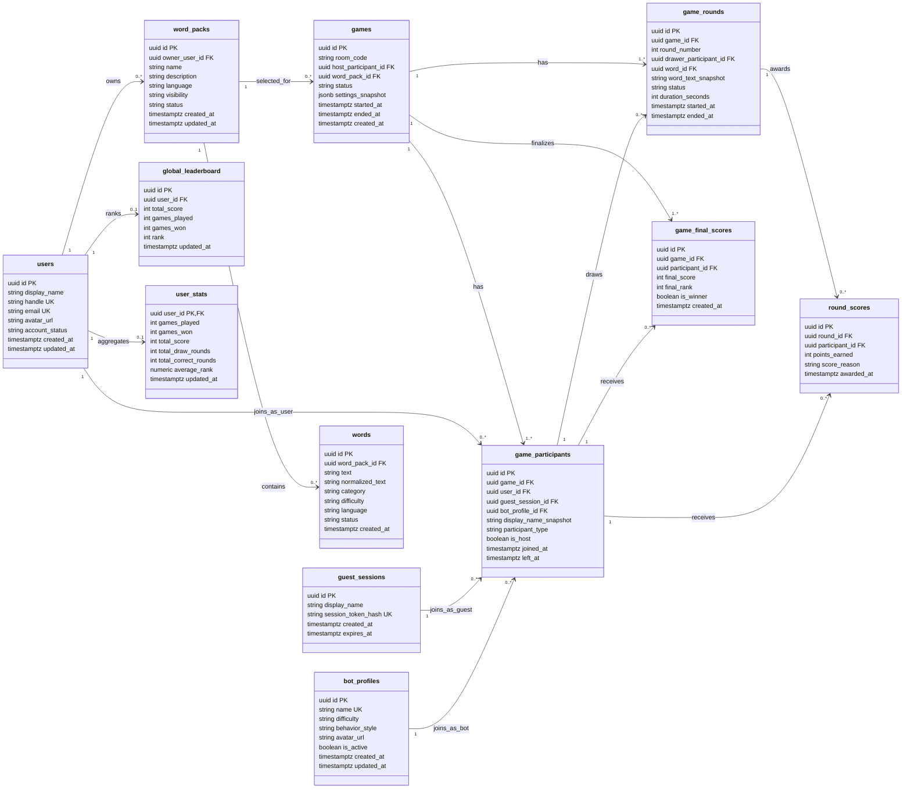
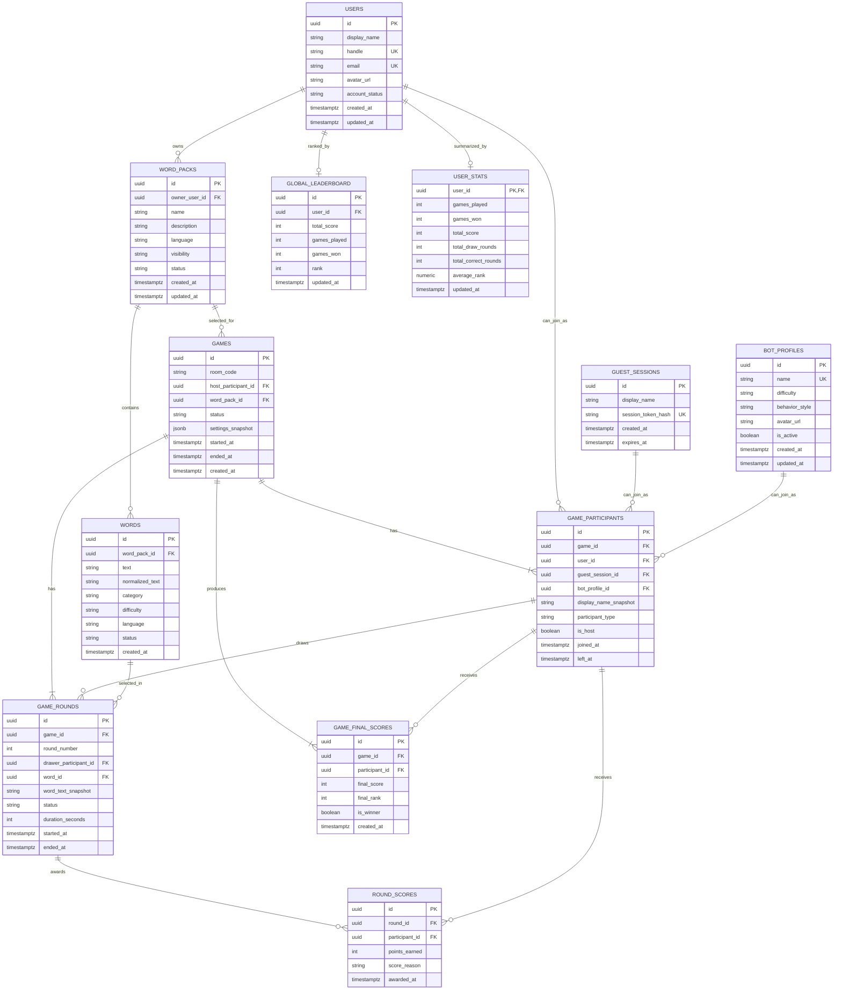

# Mithril Tiles Database Design

This document describes the MVP database design for Mithril Tiles. It focuses on durable data that should survive after a game finishes: users, guest identities, word packs, bot profiles, games, rounds, scores, and global leaderboard records.

The database is not responsible for the live WebSocket game loop. Active rooms, current timers, live strokes, temporary guesses, and in-progress scoring remain in the backend's in-memory room system while the match is running.

## MVP Direction

The MVP database intentionally avoids replay storage.

That means the database will not store:

- Drawing strokes.
- Canvas movement events.
- Guess text.
- Guess timelines.
- Chat transcripts.
- Replay event streams.
- Saved replay payloads.

Guesses matter during the round for validation and scoring, but they do not need to be stored permanently. Drawing strokes matter during live gameplay, but they do not need to be stored permanently. The database should store only the outcome of the round and the final game result.

Bot profiles are part of the database from the beginning. Bots should have reusable database profiles so they can appear consistently in games, leaderboards, and participant history.

Global leaderboards are the first leaderboard type to support. Friends, rooms, weekly seasons, or private leaderboards can come later.

## Database Role

The database supports these product needs:

- Registered users and guest identities.
- Reusable bot profiles.
- Word packs and words.
- Completed game history.
- Round outcomes.
- Final player scores.
- Global leaderboard standings.
- Aggregated user statistics.

The database should answer questions like:

- Who played this game?
- Who won?
- What rounds happened?
- Who drew each round?
- What word was used?
- How many points did each participant earn?
- Where does a user rank globally?
- Which words and word packs are available?
- Which bot profiles are active?

The database should not answer questions like:

- What did the drawer draw at second 12?
- What exact guess did a player type?
- What was the full replay timeline?
- What was every pointer movement on the canvas?

Those are deliberately outside the MVP database scope.

## Persistence Boundary

### In Memory

This data belongs in the active backend room system:

- Active room membership.
- WebSocket connections.
- Current game phase.
- Current drawer.
- Current hidden word.
- Current timer.
- Temporary drawing strokes.
- Temporary guesses.
- Temporary correct-guess tracking.
- Temporary score updates before persistence.
- Bot guess schedule during the round.

This state exists to make the game feel live. It can be discarded once the room ends, as long as the durable game outcome has been saved.

### In PostgreSQL

This data belongs in the database:

- Users.
- Guest sessions.
- Bot profiles.
- Word packs.
- Words.
- Games.
- Game participants.
- Game rounds.
- Round score summaries.
- Final game scores.
- Global leaderboard entries.
- User stats.

This data exists to support profiles, history, leaderboards, and reusable game content.

## Recommended MVP Tables

Core tables:

- `users`
- `guest_sessions`
- `bot_profiles`
- `word_packs`
- `words`
- `games`
- `game_participants`
- `game_rounds`
- `round_scores`
- `game_final_scores`
- `global_leaderboard`
- `user_stats`

Explicitly excluded from MVP:

- `guess_events`
- `drawing_events`
- `replay_events`
- `chat_messages`
- `canvas_snapshots`

## Normal Database Schema Diagram

This diagram shows the practical table layout, important columns, primary keys, and foreign keys.

## Detailed ERD Diagram

This ERD focuses on relationships and cardinality.

## Entity Details

### Users

Users represent registered players.

Purpose:

- Let players return with the same identity.
- Own word packs.
- Appear on global leaderboards.
- Accumulate long-term stats.

Important fields:

- `id`: primary key.
- `display_name`: public profile name.
- `handle`: unique public identifier if handles are supported.
- `email`: unique login email if email auth is used.
- `avatar_url`: optional profile image.
- `account_status`: active, suspended, deleted, or pending.
- `created_at` and `updated_at`: audit timestamps.

Notes:

- The user record is for registered players only.
- Guest play uses `guest_sessions`.
- Historical game display names are snapshotted in `game_participants`.

### Guest Sessions

Guest sessions represent temporary players who are not registered.

Purpose:

- Allow frictionless MVP gameplay.
- Attach a guest identity to a game participant.
- Avoid forcing account creation before playing.

Important fields:

- `id`: primary key.
- `display_name`: guest nickname.
- `session_token_hash`: hashed anonymous session identifier.
- `created_at`: when the guest session started.
- `expires_at`: when it can be cleaned up.

Notes:

- Guest sessions should not appear on global leaderboards unless you explicitly decide guest ranking is allowed.
- If a guest later creates an account, a future migration path can link or convert history.

### Bot Profiles

Bot profiles are reusable database records for server-controlled participants.

Purpose:

- Give bots stable identities.
- Support different difficulties.
- Make bot participation visible in match history.
- Allow balancing without changing game history.

Important fields:

- `id`: primary key.
- `name`: unique bot name.
- `difficulty`: easy, normal, hard, or custom.
- `behavior_style`: how the bot guesses during live rounds.
- `avatar_url`: optional bot avatar.
- `is_active`: whether the bot can be selected for new games.
- `created_at` and `updated_at`: audit timestamps.

Notes:

- Bot profiles are required for MVP.
- Bot guesses are still not stored permanently.
- Bot final scores can be stored in game history but should not count toward the user global leaderboard.

### Word Packs

Word packs group playable words.

Purpose:

- Organize words by theme, language, difficulty, or creator.
- Support built-in system packs.
- Support user-created packs later.

Important fields:

- `id`: primary key.
- `owner_user_id`: optional user owner.
- `name`: pack name.
- `description`: pack description.
- `language`: language code.
- `visibility`: public, private, or system.
- `status`: draft, published, archived, or moderation required.
- `created_at` and `updated_at`: audit timestamps.

Notes:

- System packs can have no owner.
- User-owned private packs should always have an owner.

### Words

Words are the drawable prompts used during rounds.

Purpose:

- Give the game engine a pool of valid round words.
- Allow category and difficulty filtering.
- Preserve moderation status.

Important fields:

- `id`: primary key.
- `word_pack_id`: owning word pack.
- `text`: displayed word.
- `normalized_text`: normalized value for duplicate checks and guess validation.
- `category`: optional theme or topic.
- `difficulty`: easy, medium, hard, or custom.
- `language`: language code.
- `status`: active, archived, or moderation required.
- `created_at`: audit timestamp.

Notes:

- `normalized_text` should be unique within a word pack.
- `word_text_snapshot` on `game_rounds` preserves history if the word changes later.

### Games

Games represent completed or started matches.

Purpose:

- Anchor participants, rounds, and final scores.
- Store match settings.
- Preserve game status.

Important fields:

- `id`: primary key.
- `room_code`: public room code used during play.
- `host_participant_id`: host participant snapshot.
- `word_pack_id`: selected word pack.
- `status`: started, completed, abandoned, or cancelled.
- `settings_snapshot`: round count, round duration, bot count, scoring mode, theme.
- `started_at`: when gameplay started.
- `ended_at`: when gameplay ended.
- `created_at`: when the database record was created.

Notes:

- For MVP, create the game record when the host starts the match.
- Active lobby-only rooms can remain in memory and never touch the database if abandoned.

### Game Participants

Game participants represent everyone who played in a game.

Purpose:

- Preserve the exact game roster.
- Support users, guests, and bots.
- Snapshot display names for historical accuracy.

Important fields:

- `id`: primary key.
- `game_id`: related game.
- `user_id`: present when participant is a registered user.
- `guest_session_id`: present when participant is a guest.
- `bot_profile_id`: present when participant is a bot.
- `display_name_snapshot`: display name used during the match.
- `participant_type`: user, guest, or bot.
- `is_host`: whether this participant hosted.
- `joined_at` and `left_at`: participation timestamps.

Rules:

- Exactly one of `user_id`, `guest_session_id`, or `bot_profile_id` should be set.
- `participant_type` must match the populated identity column.
- A participant belongs to exactly one game.

### Game Rounds

Game rounds preserve round-level outcomes.

Purpose:

- Track round order.
- Track the drawer.
- Track the selected word.
- Store round completion status.

Important fields:

- `id`: primary key.
- `game_id`: related game.
- `round_number`: order within the game.
- `drawer_participant_id`: participant who drew.
- `word_id`: selected word.
- `word_text_snapshot`: word text at time of play.
- `status`: completed, skipped, or abandoned.
- `duration_seconds`: configured round duration.
- `started_at` and `ended_at`: round timestamps.

Notes:

- Do not store guesses for the round.
- Do not store drawing events for the round.
- Store the outcome, not the replay.

### Round Scores

Round scores explain how participants earned points in a round.

Purpose:

- Preserve scoring transparency.
- Support per-round summaries.
- Allow final scores to be derived or audited.

Important fields:

- `id`: primary key.
- `round_id`: related round.
- `participant_id`: participant receiving points.
- `points_earned`: points awarded.
- `score_reason`: correct guess, drawer bonus, time bonus, participation bonus, or penalty.
- `awarded_at`: when points were awarded.

Notes:

- This table does not need to store the guess text.
- A correct guess can produce a score record without preserving the typed guess.

### Game Final Scores

Final scores store the completed game leaderboard.

Purpose:

- Show match results quickly.
- Preserve final rank and winner.
- Feed user stats and global leaderboard updates.

Important fields:

- `id`: primary key.
- `game_id`: related game.
- `participant_id`: participant being scored.
- `final_score`: total points.
- `final_rank`: final position in the match.
- `is_winner`: whether the participant won.
- `created_at`: when final score was recorded.

Notes:

- Final scores include users, guests, and bots for game history.
- Only registered users should update the global leaderboard by default.

### Global Leaderboard

Global leaderboard stores ranking data for registered users.

Purpose:

- Support the first leaderboard type for MVP.
- Make global ranking fast to load.
- Avoid recalculating rank from all games on every page load.

Important fields:

- `id`: primary key.
- `user_id`: ranked user.
- `total_score`: lifetime score used for ranking.
- `games_played`: completed games count.
- `games_won`: completed wins count.
- `rank`: cached global rank.
- `updated_at`: last recalculation timestamp.

Ranking recommendation:

- Primary sort: `total_score` descending.
- Tie-breaker 1: `games_won` descending.
- Tie-breaker 2: `games_played` ascending.
- Tie-breaker 3: `updated_at` ascending or user creation time ascending.

Notes:

- Bots should not appear in the global leaderboard.
- Guests should not appear unless you intentionally support guest rankings.
- Rank can be recalculated after each completed game or by a scheduled job.

### User Stats

User stats store aggregated performance for profile pages and leaderboard support.

Purpose:

- Show user progress.
- Avoid expensive aggregation across all games.
- Support global leaderboard calculations.

Important fields:

- `user_id`: primary key and foreign key.
- `games_played`: completed games played.
- `games_won`: completed games won.
- `total_score`: lifetime points.
- `total_draw_rounds`: rounds where the user was drawer.
- `total_correct_rounds`: rounds where the user earned correct-guess points.
- `average_rank`: average final rank across games.
- `updated_at`: last update timestamp.

Notes:

- These stats should be updated when a game completes.
- They are derived from game history and can be rebuilt if needed.

## Game Lifecycle Persistence

### Before Game Starts

Database may be used to:

- Load registered user or guest identity.
- Load bot profiles.
- Load available word packs.
- Load words for the selected pack.

Database should not be required to:

- Track every lobby heartbeat.
- Track every active WebSocket connection.
- Track every lobby message.
- Track guesses.
- Track strokes.

### When Game Starts

Create durable game records:

- `games`
- `game_participants`

Recommended saved data:

- Room code.
- Host participant.
- Selected word pack.
- Settings snapshot.
- Start timestamp.
- Initial participant list.
- Bot participants linked to bot profiles.

### When Each Round Starts

Create or prepare a `game_rounds` record.

Recommended saved data:

- Game ID.
- Round number.
- Drawer participant.
- Selected word.
- Word text snapshot.
- Start timestamp.
- Round duration.

Do not attach guess events or drawing events. They are intentionally not part of the MVP database.

### During Drawing

Keep live data in memory:

- Drawing events.
- Guess text.
- Correct-guess tracking.
- Temporary score changes.
- Bot guess timing.

The backend can calculate scoring live, but the database write can wait until the round outcome is stable.

### When Round Ends

Persist the round outcome:

- Round status.
- Round end timestamp.
- Round score records.
- Drawer bonus records if applicable.
- Correct-guess score records without storing guess text.

### When Game Ends

Finalize durable game history:

- Mark game completed.
- Store game end timestamp.
- Store final scores.
- Store final ranks.
- Mark winner.
- Update user stats for registered users.
- Update global leaderboard for registered users.

This is the key MVP persistence moment.

## Indexing Strategy

Indexes should support the first product queries.

Recommended indexes:

- `users.email`
- `users.handle`
- `guest_sessions.session_token_hash`
- `guest_sessions.expires_at`
- `bot_profiles.is_active`
- `bot_profiles.difficulty`
- `word_packs.owner_user_id`
- `word_packs.visibility`
- `word_packs.status`
- `words.word_pack_id`
- Unique composite index on `words.word_pack_id` and `words.normalized_text`
- `games.room_code`
- `games.status`
- `games.started_at`
- `games.ended_at`
- `game_participants.game_id`
- `game_participants.user_id`
- `game_participants.guest_session_id`
- `game_participants.bot_profile_id`
- Composite index on `game_rounds.game_id` and `game_rounds.round_number`
- `game_rounds.drawer_participant_id`
- `round_scores.round_id`
- `round_scores.participant_id`
- Composite index on `game_final_scores.game_id` and `game_final_scores.final_rank`
- `game_final_scores.participant_id`
- Unique index on `global_leaderboard.user_id`
- Composite leaderboard index on `global_leaderboard.total_score`, `global_leaderboard.games_won`, and `global_leaderboard.games_played`
- `user_stats.total_score`

No indexes are needed for guesses, strokes, or replay events because those tables are not part of the MVP schema.

## Integrity Rules

Recommended database constraints:

- `users.email` should be unique when present.
- `users.handle` should be unique when present.
- `guest_sessions.session_token_hash` should be unique.
- `bot_profiles.name` should be unique.
- `word_packs.name` should be required.
- `words.text` should be required.
- `words.normalized_text` should be required.
- `words.normalized_text` should be unique per word pack.
- `games.status` should be constrained to valid game statuses.
- `game_rounds.round_number` should be unique per game.
- `game_participants.participant_type` should be constrained to user, guest, or bot.
- Each participant should reference exactly one identity source: user, guest session, or bot profile.
- `game_final_scores.final_rank` should be unique per game.
- `global_leaderboard.user_id` should be unique.
- Completed games should have `ended_at`.
- Completed rounds should have `ended_at`.

Gameplay permissions still belong in backend logic. The database can enforce durable data shape, but it should not be responsible for live phase validation.

## JSON Snapshot Fields

JSON should be used narrowly.

Good uses:

- `games.settings_snapshot`
- Future theme settings.
- Future bot configuration snapshot.

Avoid using JSON for:

- Participants.
- Rounds.
- Scores.
- Leaderboard records.
- Guess history.
- Drawing strokes.
- Replay payloads.

If the app needs to query or rank by the value, it should usually be a column or relation.

## Global Leaderboard Strategy

Global leaderboard is part of MVP.

Recommended update flow:

1. Game ends.
2. Final scores are written to `game_final_scores`.
3. Registered user participants are selected.
4. `user_stats` is updated for each registered user.
5. `global_leaderboard` is updated for each registered user.
6. Ranks are recalculated immediately or by a scheduled job.

Leaderboard rules:

- Only completed games count.
- Only registered users count by default.
- Bots are excluded.
- Guests are excluded unless guest rankings become a product decision.
- Abandoned games do not count.
- Cancelled games do not count.

Ranking formula for MVP:

- Highest total score ranks first.
- If tied, more wins ranks higher.
- If still tied, fewer games played ranks higher.

This keeps the global leaderboard understandable and cheap to calculate.

## Data Retention

Suggested retention:

- Users: kept until deleted or anonymized.
- Guest sessions: expire after a short period.
- Bot profiles: kept while active, archived when retired.
- Word packs: kept while active, archived when removed.
- Words: kept while active, archived when removed.
- Completed game summaries: kept long-term.
- Round scores and final scores: kept long-term.
- Abandoned games: kept briefly or marked abandoned.

No retention policy is needed for replay, guesses, or drawing events in the MVP because they are not persisted.

## Privacy And Safety

Guidelines:

- Store only required profile data.
- Hash guest session tokens.
- Do not store raw authentication secrets.
- Sanitize display names before showing them.
- Preserve historical game records with display-name snapshots.
- Exclude guests and bots from global leaderboard unless explicitly changed later.
- Avoid permanently storing guess text or chat text in MVP.

## MVP Database Recommendation

The MVP database should persist:

- Users.
- Guest sessions.
- Bot profiles.
- Word packs.
- Words.
- Games.
- Game participants.
- Game rounds.
- Round scores.
- Final game scores.
- Global leaderboard entries.
- User stats.

The MVP database should not persist:

- Drawing strokes.
- Guess text.
- Guess event history.
- Chat messages.
- Replay events.
- Canvas snapshots.

This gives the project enough durability for profiles, bots, words, match history, final scores, and global ranking without slowing down the live drawing and guessing loop.

## Remaining Decisions

These decisions are still open for you to direct:

- Should guest players be allowed to start rooms, or only join rooms?
- Should guests ever appear on a separate guest leaderboard?
- Should global leaderboard rank by lifetime score only, or include win rate later?
- Should bot scores appear in game history exactly like human scores?
- Should abandoned games be deleted or kept with an abandoned status?
- Should public user-created word packs be available in MVP or only system packs?
